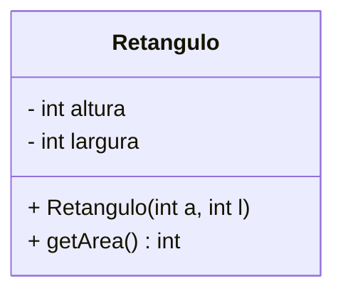

# Diagrama de classes UML



```mermaid
classDiagram
    direction LR
    class Carro{
        -marca: String
        +propulsor: Motor
        +Carro(ma: String, mo: Motor)
        +acelerar(v: int) void
        +trocarMotor(m: Motor) void
    }
    class Motor{
        -hp: motor
        -giroAtual: int
        -cilindros int
        +Motor()
        +acelerar(v: int) void
    }
    Carro "1" o-- "1" Motor : 
```