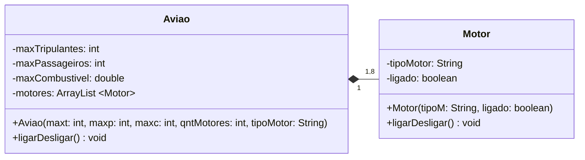

#Avião

```mermaid
classDiagram
    direction LR
        class Aviao{
            -maxTripulantes: int
            -maxPassageiros: int
            -maxCombustivel: double
            -motores: ArrayList ~Motor~
            +Aviao(maxt: int, maxp: int, maxc: int, qntMotores: int, tipoMotor: String )
            +ligarDesligar() void 
        }
        class Motor{
            -tipoMotor: String
            -ligado: boolean
            +Motor(tipoM: String, ligado: boolean)
            +ligarDesligar() void
        }
        Aviao "1" *-- "1,8" Motor

```