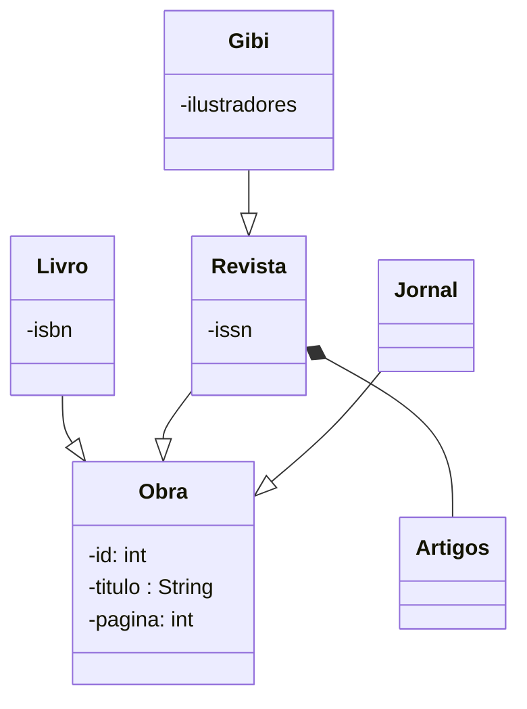

# Exercício 01
 ```mermaid
 classDiagram
     direction LR
     class Pessoa{
         -nome
         -email
     }
     
     class Aluno{
         -matricula : String
     }
     class Professor{
         - salario : double
         
     }
     class Coordenador{
         -Curso : String
         
     }
     class Diretor{
         
     }
     class Funcionario
     Aluno --|> Pessoa
     Professor --|> Funcionario
     Coordenador --|> Professor
     Funcionario --|> Pessoa
     Diretor --|> Funcionario
```
# Exercício 02
