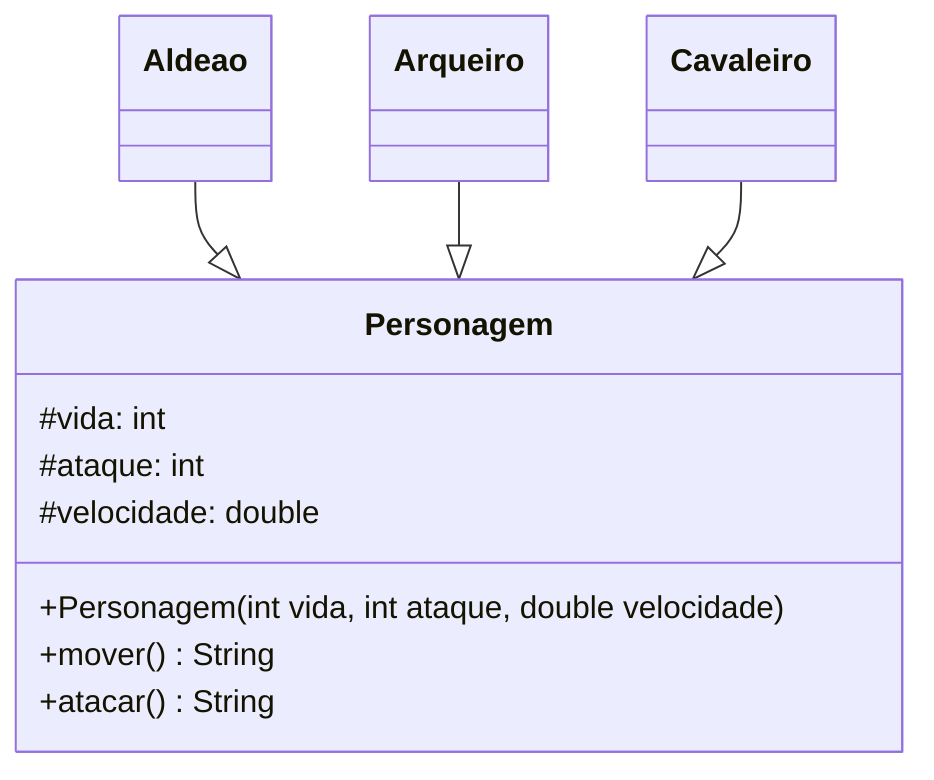

# Java of Empires

```mermaid
classDiagram
    class Personagem{
        #vida: int
        #ataque: int
        #velocidade: double
        +Personagem (int vida, int ataque, double velocidade)
        +mover() String
        +atacar() String
    }
    
    class Aldeao{

    }
    
    class Arqueiro{
        
    }
    
    class Cavaleiro{
        
    }
    
    Aldeao --|> Personagem
    Arqueiro --|> Personagem
    Cavaleiro --|> Personagem
```