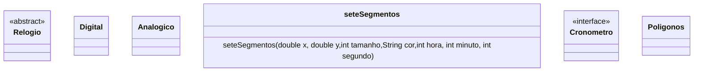

# Relógios e cronômetros

```mermaid
classDiagram
    class Relogio{
        <<abstract>>
        
    }
    
    class Digital{
        
    }
    
    class Analogico{
        
    }
    
    class seteSegmentos{
        seteSegmentos(double x, double y,int tamanho,String cor,int hora, int minuto, int segundo)
    }
    
    class Cronometro{
        <<interface>>
    }
    
    class Poligonos{
        
    }
    
    
    
```